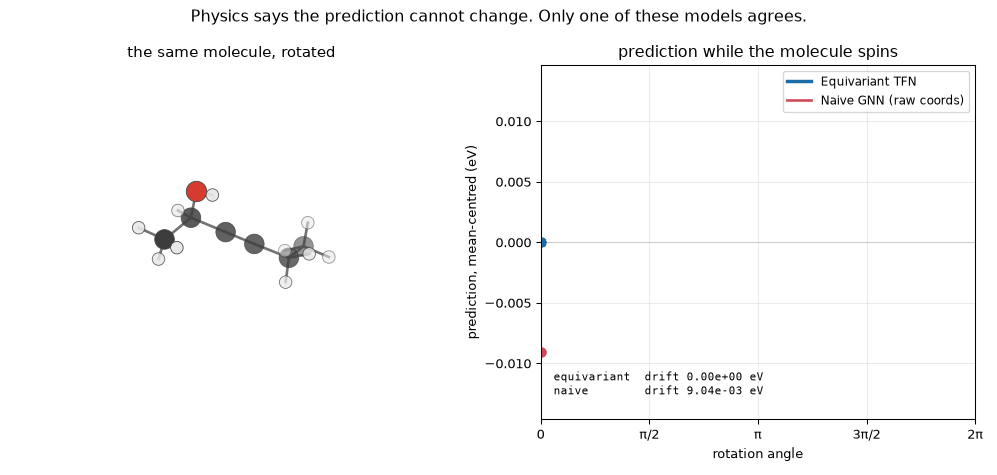
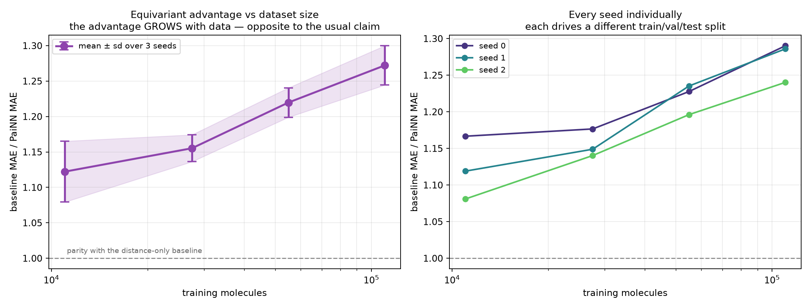
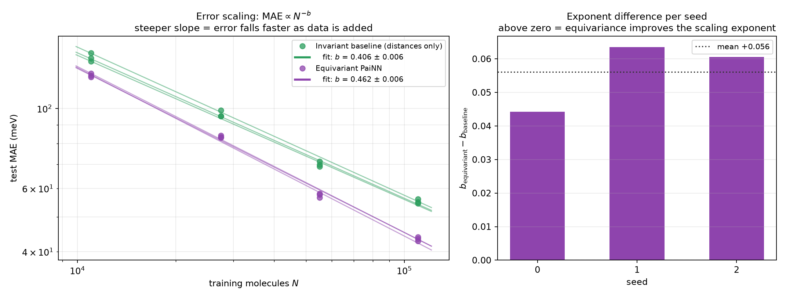

# SymmetryNet — E(3)-equivariant graph neural networks for molecular property prediction

A neural network that **mathematically guarantees** its predictions are unchanged when
you rotate the molecule — rather than hoping it learns that from data — with the
representation theory implemented from scratch and verified numerically.


Both models on the left are **untrained**. That is the point: equivariance is a property
of the architecture, so it holds for every setting of the weights, including random
initialisation. The raw-coordinate models swing by ~10⁻² eV as the molecule spins; the
equivariant models are flat to ~10⁻¹⁵ eV, which is float64 rounding noise.

| model | worst \|f(Rx) − f(x)\| / \|f(x)\| over 200 random rotations |
|---|---|
| Equivariant TFN (ℓ_max = 2) | **1.3 × 10⁻¹⁵** |
| Invariant baseline (distances only) | **2.8 × 10⁻¹⁵** |
| Naive GNN (raw coordinates) | 1.2 × 10⁻² |
| Naive MLP (raw coordinates) | 1.3 × 10¹ |

PaiNN holds the same bound — its *internal vector features* are additionally verified to
come back rotated by the correct matrix, not merely to leave the output unchanged, since
an invariant output alone would also be produced by a model whose vector channels had
silently collapsed to zero.

Thirteen orders of magnitude, measured in float64 — see
[`scripts/make_equivariance_plot.py`](scripts/make_equivariance_plot.py).

The error is reported *relative* to each model's own output scale, deliberately.
Untrained networks have arbitrary output magnitudes, so ranking raw absolute residuals
would sort models by how large their outputs happen to be rather than by how well they
respect the symmetry. Absolute values and scales are both recorded in
[`results/equivariance.json`](results/equivariance.json).



The same fact as an animation: one molecule, rotated through a full turn. Both models are
untrained, and the equivariant prediction does not move.

**Interactive version** — [`results/demo.html`](results/demo.html) is a self-contained page
with no server and no dependencies: clone the repo and open it in a browser to drag the
molecule yourself. Rebuild it with:

```bash
python scripts/make_interactive_demo.py && python scripts/build_demo_page.py
```

---

## The idea in one paragraph

A molecule's HOMO-LUMO gap does not depend on how you happened to orient it when you
wrote down the coordinates. Most GNNs either discard 3D geometry entirely or feed in raw
coordinates and hope rotation-invariance emerges from data augmentation. An
**equivariant** network instead constrains every layer to transform in a mathematically
prescribed way under rotation, so it *cannot represent* a symmetry-violating function.
Directional information is carried through the network in a form that transforms
predictably, and is collapsed to an invariant scalar only at the final readout. The
result is a smaller hypothesis space containing exactly the physically meaningful
functions — which is why it is also more data-efficient.

The mechanism is representation theory: features are labelled by the irreducible
representations of SO(3) (indexed by degree ℓ), directions are encoded with spherical
harmonics, and features are combined with Clebsch-Gordan tensor products, the equivariant
analogue of a weight matrix.

**[→ Read the full derivation](docs/math_foundations.md)** — why spherical harmonics are
the natural basis for SO(3) irreps, and what a Clebsch-Gordan tensor product actually
computes.

---

## Results

QM9 HOMO-LUMO gap, 110k train / 10k validation / 10,831 test. Every model shares one
training loop, optimiser, learning-rate schedule, radial basis, cutoff and readout — only
`--model` changes.

**Within any single comparison the epoch budget is identical for both models.** It varies
*between* comparisons, deliberately: the 50-vs-200-epoch result below shows the equivariant
model needs roughly four times the baseline's schedule to converge, so a learning curve
must train each point to convergence rather than to a fixed count. Every number quoted here
is labelled with its budget and whether that run actually converged.

<!-- RESULTS_TABLE_START -->

### The angular ablation works exactly as the theory predicts — within one architecture

`l_max = 0` is the informative control: a *fully equivariant* architecture in which the
selection rule permits only `0 ⊗ 0 → 0`, so no angular path exists at all. Raising
`l_max` opens paths that can represent bond angles.

| `l_max` | representable | params | test MAE (50 epochs) |
|---|---|---|---|
| 0 | scalars only | 154k | 113.59 meV |
| 1 | + vectors | 306k | 89.55 meV |
| 2 | + rank-2 tensors | 573k | **78.63 meV** |


> These three runs share a **50-epoch** budget, so they are internally comparable but sit
> above the 200-epoch numbers quoted elsewhere (`l_max=2` reaches 59.43 meV given the
> longer schedule). The ablation is about the *ordering*, which the shared budget makes
> valid; it is not a source of absolute figures.

Monotone, −31% from `l_max=0` to `l_max=2`. Angular information is measurably worth
something, and the effect is isolated from every other architectural variable.

The caveat is important and easy to miss: this holds *within* the TFN family. PaiNN caps
out at `l<=1` and still beats TFN at `l_max=2` by 27%, so the ablation must not be read as
"higher `l_max` is better, full stop". It says angular information helps once you have
already committed to this architecture.

### Why higher ℓ helps yet loses: measuring what each degree contributes

Those two facts together are confusing — is the TFN's ℓ=2 channel doing real work, or is
it along for the ride while the extra parameters do the lifting? Accuracy alone cannot
separate those, so
[`scripts/irrep_utilization.py`](scripts/irrep_utilization.py) measures the channels
directly on a trained model:

| degree | components | RMS per component | **∂ŷ/∂h per component** |
|---|---|---|---|
| ℓ=0 | 1 | 1.009 (1.00×) | 3.34e-03 (**1.00×**) |
| ℓ=1 | 3 | 1.021 (1.01×) | 1.24e-03 (**0.37×**) |
| ℓ=2 | 5 | 1.035 (1.03×) | 9.08e-04 (**0.27×**) |

Feature *magnitudes* are essentially equal per component — BatchNorm sees to that, so no
degree is amplified or starved. But the prediction is **3.7× less sensitive to an ℓ=2
component than to a scalar**. The paths that require Clebsch-Gordan tensor products, and
cost 5× the compute, carry proportionally less influence over the output.

That reconciles the two results. ℓ=2 is genuinely used — removing it costs 12% accuracy —
but each of its components earns less per unit of compute than a scalar does. PaiNN spends
the same budget on ℓ≤1 with more width and depth, and comes out ahead. Cross-checked on
the independently trained `l_max=1` model, where ℓ=1 measures 0.41× against 0.37× here.

<details>
<summary>Two probes that did not work, and why</summary>

**Zero a degree and measure the damage.** Uninformative: removing *any* degree degrades
test MAE by ~1800%, including ℓ=0. Deleting a whole channel takes a deep network so far
off its training distribution that everything collapses equally.

**Share of total feature magnitude.** Measured 13.8 / 31.8 / 54.4% for ℓ=0,1,2 — but those
are almost exactly the *dimension* shares (11.1 / 33.3 / 55.6%, since a degree-ℓ channel
holds 2ℓ+1 components). It was reporting how many slots each degree owns, not how hard it
works. Hence per-component normalisation throughout above.
</details> Note the
baseline line already sits below all three bars — which is the next result.

### The headline: equivariance wins, and it is not just angle-awareness

All four at 200 epochs, same loop, same data, same schedule:

| model | equivariant? | sees angles? | params | test MAE | ms/step |
|---|---|---|---|---|---|
| **Equivariant PaiNN** (`l<=1`) | ✔ | ✔ | 576k | **43.43 meV** | 13.3 |
| Angle-aware invariant | ✘ | ✔ | 369k | 52.27 meV | 71 |
| Distance-only baseline | ✘ | ✘ | 277k | 56.03 meV | 6.9 |
| Equivariant TFN (`l_max=2`) | ✔ | ✔ | 573k | 59.43 meV | 67.9 |

The angle-aware invariant model is the control that makes this readable. Without it,
equivariance and angular information are confounded — every equivariant model here also
sees angles, and the only angle-free model is also the only non-equivariant one. With it,
the 22.5% gap decomposes:

- **angles alone, in invariant form: 56.03 → 52.27 meV (−6.7%)**
- **equivariance on top of that: 52.27 → 43.43 meV (−16.9%)**

So angular information accounts for under a third of PaiNN's advantage. **Equivariance
contributes roughly two and a half times more than angle-awareness does** — it is not
merely an expensive way to obtain angles, which was the live alternative explanation.

The mechanism is visible in the design. The angular model reads angles as
:math:`P_\ell(\cos\theta)` and immediately collapses them to scalars, so a later layer
cannot compose them geometrically. An equivariant model carries direction forward as an
`l>0` feature that later layers can keep operating on. Access to angles is the same; what
differs is whether that information survives the next layer.

The cost column sharpens it further. The angle-aware model is **5× slower per step than
PaiNN and still 20% worse**: enumerating ~414k explicit triplets per batch is a strictly
worse deal than equivariant vector algebra, which obtains the same angular content as a
by-product of its representation.

And the TFN — equivariant, `l_max=2` — is beaten by an *invariant* model. Being
equivariant is no guarantee of anything by itself.

PaiNN beats the baseline by **22.5%** and the TFN by **26.9%** — and does it in under a
third of the TFN's compute at the same parameter count. Published PaiNN on this exact
target is 45.7 meV; this implementation reaches 43.43, so it is a faithful one.

**Three findings sit on top of each other here, and the order matters.**

*Equivariance alone is not the win.* The TFN is exactly equivariant and still loses to a
distance-only baseline that reproduces published SchNet. Building in the symmetry does not
by itself buy accuracy.

*The right equivariant architecture wins decisively.* Same symmetry group, same target,
same budget — a 22.5% improvement over the strongest non-equivariant model here.

*And the winner has **less** angular resolution than the loser.* The ablation below shows
`l_max=2` beats `l_max=1` by 12% inside the TFN family. Yet PaiNN, structurally capped at
`l<=1`, beats TFN at `l_max=2` by 27%. So "more angular resolution is better" is true
*within* an architecture and does not transfer *across* architectures. The binding
constraint was never angular resolution — it was that Clebsch-Gordan tensor products cost
5× more per step, and that compute buys more when spent on width and depth.

<details>
<summary>How the training budget confounded an earlier version of this comparison</summary>

At 50 epochs the TFN looked far worse (78.63 vs 63.82). Quadrupling the schedule closed
most of that gap, because the two models converge at very different rates:

| model | 50 epochs | 200 epochs | change | best epoch (of 200) |
|---|---|---|---|---|
| Distance-only baseline | 63.82 meV | 56.03 meV | −12.2% | 111 — converged, then flat |
| Equivariant TFN | 78.63 meV | 59.43 meV | −24.4% | 184 — still improving |

The short-budget comparison was mostly measuring which model converges faster, not which
is better. Every number quoted above uses the 200-epoch runs.
</details>

### Data efficiency: PaiNN wins everywhere, but the hypothesis is still contradicted

Every point below is trained to convergence rather than to a fixed epoch count. That
distinction is not cosmetic: a point at 10% data sees a fifth as many gradient steps per
epoch as one at 50%, so a fixed budget converges the small-data points while starving the
large-data ones. An earlier version of this curve had exactly that defect and was
misleading. [`scripts/consolidate_data_efficiency.py`](scripts/consolidate_data_efficiency.py)
now checks convergence automatically and refuses to report a point silently.

| training molecules | baseline | **PaiNN** | TFN | PaiNN ratio | TFN ratio |
|---|---|---|---|---|---|
| 11,000 (10%) | 142.03 | **122.28** | 182.66 | 1.16× | 0.78× |
| 27,500 (25%) | 98.06 | **84.12** | 117.31 | 1.17× | 0.84× |
| 55,000 (50%) | 71.31 | **58.09** | 80.47 | 1.23× | 0.89× |
| 110,000 (100%) | 56.03 | **43.43** | 59.43 | 1.29× | 0.94× |


**PaiNN beats the baseline at every training set size** — a real, architecture-level win
for equivariance, not an artifact of one operating point.

**And yet the data-efficiency hypothesis is contradicted, and this replicates across
seeds.** The prediction was that symmetry constraints matter *most* when data is scarce, so
the equivariant advantage should be largest at the left of the plot and shrink to the
right. It does the opposite. Repeating the whole grid over **3 seeds** — each driving a
different train/val/test split *and* a different initialisation:

| training molecules | seed 0 | seed 1 | seed 2 | mean ± sd |
|---|---|---|---|---|
| 11,000 | 1.167 | 1.119 | 1.081 | **1.122 ± 0.043** |
| 27,500 | 1.177 | 1.149 | 1.140 | **1.155 ± 0.019** |
| 55,000 | 1.228 | 1.235 | 1.196 | **1.220 ± 0.021** |
| 110,000 | 1.290 | 1.286 | 1.240 | **1.272 ± 0.028** |



- Monotone in the mean across all four sizes
- The advantage grows with data in **3 of 3 seeds** — unanimous
- Gap between extremes **+0.150** against a pooled sd of **0.051** — separated at ~3 sd

Within a seed both models see byte-identical data, so each ratio is a paired comparison;
across seeds the split changes, so a trend surviving all three is robust to the partition
rather than an artifact of one lucky draw. With n=3, a t-test p-value would be false
precision — unanimity plus non-overlapping spread is the strongest claim three seeds
support, and that is what is reported.

The TFN shows the same *direction* while losing outright throughout (0.78 → 0.94 at seed
0), so this is not a quirk of one architecture: two equivariant models, opposite outcomes,
same trend.

### What the growing ratio actually means: equivariance buys a steeper exponent

The ratio table is descriptive. The same runs support a sharper claim. Error curves here
follow a power law tightly — `MAE(N) ≈ A·N^(−b)`, with **R² ≥ 0.997** on every single fit —
so the exponent `b` is a meaningful quantity rather than a line forced through scatter.

| model | scaling exponent `b` |
|---|---|
| Distance-only baseline | **0.406 ± 0.006** |
| Equivariant PaiNN | **0.462 ± 0.006** |
| **difference** | **+0.056 ± 0.010** (steeper in 3/3 seeds, ≈5 sd) |



This explains the growing ratio rather than merely restating it. Taking the ratio of two
power laws gives `(A_base/A_equi)·N^(b_equi − b_base)`, so the ratio can *only* grow with
`N` if the equivariant exponent is steeper. It is, by 14% relative.

**And that reframes the whole result.** "Data efficiency" as usually claimed means a better
*offset* — fewer samples to reach a given error, so the advantage is largest when data is
scarce. That is not what equivariance buys here. It buys a better *exponent*: the rate at
which error falls with data improves. Those are different mechanisms with opposite
signatures, and this measurement distinguishes them.

Arguably the exponent is the more valuable of the two. An offset advantage is a fixed
discount; an exponent advantage compounds with every molecule added. So the honest summary
is not "equivariance failed to deliver data efficiency" but **"equivariance improves scaling
rather than sample efficiency"** — a more specific and more useful statement than the
hypothesis it replaces.

Reproduce with [`scripts/fit_scaling.py`](scripts/fit_scaling.py); fitted values in
[`results/scaling.json`](results/scaling.json).

### Testing the obvious objection: forces (MD17)

Everything above measures a *scalar* target. The natural objection is that the usual
data-efficiency claim was made for **tensorial** ones — NequIP's headline result is about
forces, which are ℓ=1 — so the finding might be a scalar-target artifact. If forces
reversed the trend, the contradiction would become a boundary condition rather than a
general failure, which would be a more useful result.

MD17 ethanol, forces (kcal/mol/Å), in the small-data regime where the claim originated:

| training configurations | baseline | PaiNN | ratio |
|---|---|---|---|
| 250 | **0.5378** | 0.9284 | 0.58 |
| 500 | **0.3847** | 0.5333 | 0.72 |
| 1000 | **0.3047** | 0.3125 | 0.98 |
| 2000 | 0.1753 | 0.1755 | 1.00 |

**Same direction as the scalar target.** The advantage grows with data here too (0.58 →
1.00), so switching to a tensorial target does not rescue the data-efficiency claim. On
this evidence it fails on both target types, which is a stronger statement than the QM9
result alone — but note it is also a *weaker experiment*, for reasons worth being explicit
about:

- **PaiNN never actually wins here.** It only reaches parity at N=2000, whereas on QM9 it
  beat the baseline everywhere. Forces are supposed to be its strong suit.
- **Our PaiNN is below its published capability** — 0.3125 at N=1000 against a published
  ~0.23. So the *level* of this curve is suspect and probably understates PaiNN. The
  *trend* is the more robust part, but it rests on a model that is not at full strength.
- **Seed 0 only.** After the QM9 experience, one seed is not treated as established.
- **MD17 frames are consecutive MD snapshots**, so a random split leaks between train and
  test. That is the standard protocol every published number shares, so absolute values are
  optimistic across the board and only the relative comparison is meaningful.

The honest summary: this is consistent with the QM9 finding and does not support the
scalar-vs-tensorial boundary, but it is suggestive rather than conclusive.

**Budgets are chosen per configuration on validation, not fixed.** No single training
budget suits every model and dataset size here — at N=250 the baseline reaches its best
validation score around 25k steps and then *degrades*, its validation error rising from
0.57 to 0.83 by 600k. Treating the budget as a hyperparameter selected on validation, with
test reported separately, is what makes the comparison fair. See
[`scripts/consolidate_forces.py`](scripts/consolidate_forces.py) for why three different
convergence heuristics were tried and discarded first.

**This also falsifies my own earlier explanation.** When only the TFN had been tested, I
attributed its backwards trend to optimisation difficulty — the tensor-product model needed
roughly four times the baseline's schedule to converge, and I argued that cost outweighed
the symmetry benefit when data was scarce. PaiNN tests that directly: it keeps the symmetry
and removes most of the optimisation burden. The explanation survives for the *level* (PaiNN
sits above 1.0 where the TFN sits below) but fails for the *slope*, which is unchanged.
Whatever drives the trend is not optimisation difficulty. I do not have a confirmed
explanation for it, and would rather say so than invent one.

One honest caveat: the 100% TFN point was interrupted at epoch 185/186 with its best epoch
last, so it is marginally under-converged and its true ratio is slightly above 0.94. That
nudges one point in the direction the hypothesis wants and does not affect the PaiNN curve
at all.

**Why this is a real result and not a broken baseline.** The control lands at 63.8 meV;
published SchNet on this exact QM9 target is ~63 meV. Reproducing the literature number
is what makes the comparison trustworthy — the baseline is a genuine opponent, not a
strawman. Meanwhile TFN is a 2018 architecture that later equivariant models (PaiNN
45.7 meV, DimeNet++ 32.6 meV) substantially improved on; "equivariant" is not by itself
a guarantee of winning.

**Where the compute budget does and doesn't explain it.** The equivariant model's best
epoch was the *final* epoch at 50% and 100% data — it was still improving when the budget
ran out, so those two points understate it. But at 25% and 10% it converged well before
the cap (best epoch 127/200 and 165/250) and still lost by 16–29%. Small-data is precisely
where the data-efficiency argument should be strongest, so the budget does not rescue the
hypothesis there.

Full numbers, including per-epoch histories, in
[`results/results_table.md`](results/results_table.md).
<!-- RESULTS_TABLE_END -->

Note on absolute numbers: these are short-budget runs (tens of epochs) chosen so the whole
suite fits on one laptop GPU. Published QM9 gap results (SchNet ≈ 63 meV, PaiNN ≈ 45.7 meV,
DimeNet++ ≈ 32.6 meV) train far longer with larger models. The comparison here is
*internal and controlled* — the same budget for both models — which is what makes the
delta attributable to equivariance rather than to tuning.

---

## What is in here

```
src/symmetrynet/
├── scratch/            Phase 2: everything derived and implemented BY HAND
│   ├── spherical_harmonics.py   closed-form real SH, l = 0..3
│   ├── clebsch_gordan.py        Racah formula + complex→real basis change
│   ├── wigner.py                Wigner-D built recursively from CG (no SH used)
│   ├── tensor_product.py        equivariant linear / tensor product / gate
│   └── layer.py                 a complete TFN layer and small model
├── models/
│   ├── baseline.py     distance-only invariant GNN (the control)
│   ├── tfn.py          e3nn Tensor Field Network — Clebsch-Gordan products, l<=2
│   ├── painn.py        PaiNN — equivariant via vector algebra alone, l<=1 (best result)
│   └── naive.py        raw-coordinate models (the failure case)
├── nn/radial.py        Bessel / Gaussian bases and smooth cutoffs (shared by all models)
├── data/qm9.py         splits, standardization, data-efficiency subsets
├── utils/precision.py  the float64-construction helper, and why it is needed
└── train.py            one training loop shared by every model
```

The from-scratch implementation in `scratch/` is deliberately kept in the repository even
though `models/tfn.py` uses `e3nn`. It calls no library function for any of the
representation theory, and it is checked against `e3nn` in the test suite:

- spherical harmonics agree to **1e-16**
- hand-derived Clebsch-Gordan coefficients agree with `e3nn`'s `wigner_3j` to **1e-16** in float64
- the from-scratch model is rotation-, translation-, inversion- and permutation-invariant to **1e-16**

---

## Three findings worth writing down

All were found by measurement, not by reading documentation, and each is the kind of
thing that silently produces a plausible-but-wrong result.

**1. `e3nn` bakes Wigner-3j constants at construction dtype.** Building a model under the
default float32 and then calling `.double()` converts parameters and buffers but *not* the
constants compiled into each `TensorProduct`. The equivariance residual becomes:

| ℓ_max | built at float32, cast to float64 | built at float64 |
|---|---|---|
| 1 | 1.3e-15 | 2.7e-15 |
| 2 | **2.1e-09** | 1.3e-15 |
| 3 | **8.0e-09** | 1.3e-15 |

Six orders of magnitude, appearing only for ℓ_max ≥ 2 — very easy to misread as "the
higher-degree paths are subtly buggy". They are not; only the constants were rounded. Use
[`utils.precision.default_dtype`](src/symmetrynet/utils/precision.py), which the test
suite asserts is still necessary.

**2. `FullyConnectedTensorProduct` does not fit in memory at realistic widths.** Its
per-edge weights scale as `mul_in × mul_out` per path — about 65k weights per edge at
`multiplicity=64`, so a batch of 96 QM9 molecules needs a **7.1 GiB** tensor for one
forward pass. Switching to `uvu` connection mode (per-channel weights) followed by an
`o3.Linear` to mix channels recovers the same expressiveness at ~100× less memory. This is
what NequIP does, and the reason why is not obvious until you hit the OOM.

**3. An exactly-equivariant model can still be badly conditioned — and it fails silently.**
The first full comparison had the equivariant model *losing*: **116.0 meV against the
baseline's 78.4 meV**, a 48% deficit. It was not a symmetry bug (equivariance was exact
to 1e-15 throughout) and not a capacity limit. Instrumenting the activations found two
compounding scale errors:

- The Bessel radial basis has values of order 0.3, not 1. The radial MLP consuming it is
  initialised for unit-variance inputs, so it emitted tensor-product weights with
  **std 0.12** — and e3nn's tensor product normalises assuming unit-variance weights. The
  message pathway was attenuated ~8×, worsening with depth (message/skip ratio falling
  0.27 → 0.115 over four layers).
- Fixing that exposed the opposite error. Dividing the neighbour sum by
  `sqrt(avg_num_neighbors)` assumes messages arriving at an atom are independent. They
  are not — they share the central atom's features — so the sum grows like *N*, not √*N*,
  leaving a gain of ~4 per layer. Activations compounded **1.5 → 4.7 → 11.7 → 47.9**.

Equivariant `BatchNorm` (which rescales each irrep by its *norm*, a rotation-invariant
quantity, so symmetry is untouched) flattens the layer standard deviations to
**1.00, 1.00, 1.00, 1.00**. The lesson generalises: "provably equivariant" says nothing
about being well-conditioned, and the failure mode is a model that trains stably, passes
every symmetry test, and merely underfits.

An equivariance error is also only meaningful relative to the model's own reproducibility
floor, so the test suite measures that too: CUDA `scatter_add` uses atomics and float
addition is not associative, giving a floor of ~2e-15 that the tolerance must sit above.

---

## Quick start

Install PyTorch first, matching your GPU — the CUDA build must come from PyTorch's own
index, not PyPI (see [Environment](#environment) for the Blackwell case):

```bash
pip install torch --index-url https://download.pytorch.org/whl/cu128
```

Then the project itself:

```bash
pip install -e ".[dev]"
```

QM9 (~130k molecules) downloads automatically on first use into `~/.symmetrynet/data`.
Override with `SYMMETRYNET_DATA_ROOT`.

> If `data.pyg.org` fails to resolve on your network, fetch
> `https://data.pyg.org/datasets/qm9_v3.zip` by any means and unzip `qm9_v3.pt` into
> `$SYMMETRYNET_DATA_ROOT/QM9/raw/`. PyTorch Geometric skips the download when the raw
> file is already present.

Verify the symmetry claims — 213 tests, the symmetry ones all in float64:

```bash
pytest
```

| file | tests | covers |
|---|---|---|
| `test_clebsch_gordan.py` | 81 | Racah formula, orthonormality, the intertwining identity, agreement with e3nn |
| `test_model_equivariance.py` | 36 | rotation / translation / inversion / permutation invariance, and that the controls fail |
| `test_spherical_harmonics.py` | 33 | closed forms, addition theorem, parity, e3nn's axis convention |
| `test_wigner.py` | 26 | group homomorphism, orthogonality, Haar-uniform sampling |
| `test_scratch_layer.py` | 19 | the from-scratch layer, end to end |
| `test_nn_components.py` | 18 | radial bases, graph construction, activation-scale regression guards |

Reproduce the headline figure:

```bash
python scripts/make_equivariance_plot.py
```

Rebuild the interactive demo — a page where you drag the molecule around and watch each
model's prediction (or its drift):

```bash
python scripts/make_interactive_demo.py && python scripts/build_demo_page.py
```

It writes a single self-contained `results/demo.html` with the orientation grid inlined,
so it opens straight from disk with no server.

Train and compare:

```bash
python scripts/run_experiments.py comparison --epochs 50
```

```bash
python scripts/run_experiments.py data_efficiency
```

```bash
python scripts/run_experiments.py ablation
```

Then regenerate figures and the results table:

```bash
python scripts/make_results_plots.py
```

---

## Verifying equivariance yourself

```python
import torch
from symmetrynet.models import TensorFieldNetwork
from symmetrynet.scratch.wigner import random_rotation
from symmetrynet.utils.precision import default_dtype

with default_dtype(torch.float64):          # see finding (1) above
    model = TensorFieldNetwork(l_max=2).eval()

species = torch.randint(0, 5, (12,))
pos = torch.randn(12, 3, dtype=torch.float64) * 1.6
batch = torch.zeros(12, dtype=torch.long)

with torch.no_grad():
    base = model(species, pos, batch)
    R = random_rotation(1, dtype=torch.float64)
    rotated = model(species, pos @ R.T, batch)

print((rotated - base).abs().max())   # ~1e-15, for untrained weights
```

---

## Environment

Developed on Windows 11 with an RTX 5070 Ti Laptop GPU (Blackwell, `sm_120`), which needs
the CUDA 12.8 PyTorch build:

```bash
pip install torch --index-url https://download.pytorch.org/whl/cu128
```

`torch-cluster` is deliberately **not** a dependency — it has no reliable Windows wheels.
QM9 molecules cap at 29 atoms, so `utils/graph.py` builds radius graphs with a chunked
dense computation instead, which is fast enough and keeps the project `pip`-installable.

## License

MIT
