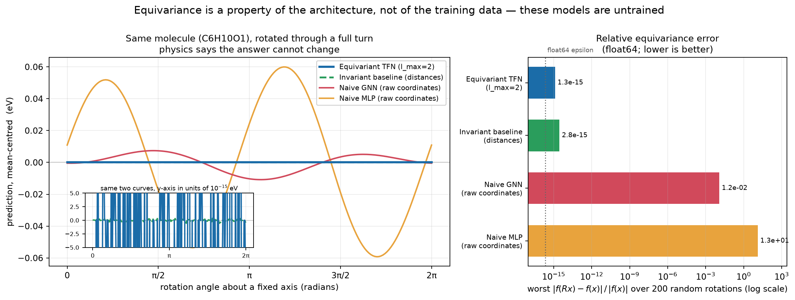
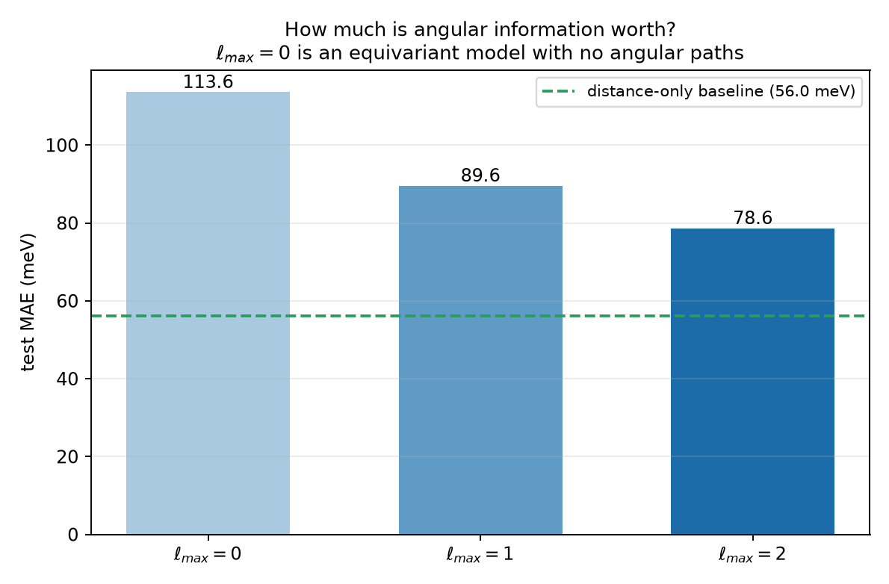
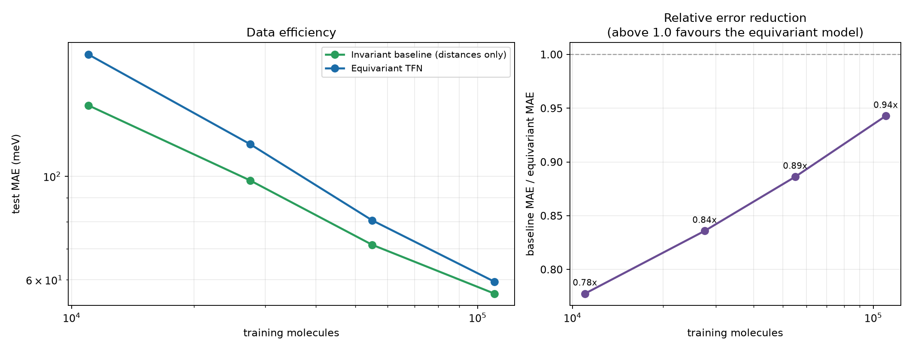

# SymmetryNet — E(3)-equivariant graph neural networks for molecular property prediction

A neural network that **mathematically guarantees** its predictions are unchanged when
you rotate the molecule — rather than hoping it learns that from data — with the
representation theory implemented from scratch and verified numerically.



Both models on the left are **untrained**. That is the point: equivariance is a property
of the architecture, so it holds for every setting of the weights, including random
initialisation. The raw-coordinate models swing by ~10⁻² eV as the molecule spins; the
equivariant models are flat to ~10⁻¹⁵ eV, which is float64 rounding noise.

| model | worst \|f(Rx) − f(x)\| / \|f(x)\| over 200 random rotations |
|---|---|
| Equivariant TFN (ℓ_max = 2) | **1.3 × 10⁻¹⁵** |
| Invariant baseline (distances only) | **2.8 × 10⁻¹⁵** |
| Naive GNN (raw coordinates) | 1.2 × 10⁻² |
| Naive MLP (raw coordinates) | 1.3 × 10¹ |

Thirteen orders of magnitude, measured in float64 — see
[`scripts/make_equivariance_plot.py`](scripts/make_equivariance_plot.py).

The error is reported *relative* to each model's own output scale, deliberately.
Untrained networks have arbitrary output magnitudes, so ranking raw absolute residuals
would sort models by how large their outputs happen to be rather than by how well they
respect the symmetry. Absolute values and scales are both recorded in
[`results/equivariance.json`](results/equivariance.json).

**[▶ Try the interactive demo](https://claude.ai/code/artifact/79cac988-a756-4983-b871-fc434b3edd11)** —
drag a molecule around and watch two predictions hold still while the third wanders.

---

## The idea in one paragraph

A molecule's HOMO-LUMO gap does not depend on how you happened to orient it when you
wrote down the coordinates. Most GNNs either discard 3D geometry entirely or feed in raw
coordinates and hope rotation-invariance emerges from data augmentation. An
**equivariant** network instead constrains every layer to transform in a mathematically
prescribed way under rotation, so it *cannot represent* a symmetry-violating function.
Directional information is carried through the network in a form that transforms
predictably, and is collapsed to an invariant scalar only at the final readout. The
result is a smaller hypothesis space containing exactly the physically meaningful
functions — which is why it is also more data-efficient.

The mechanism is representation theory: features are labelled by the irreducible
representations of SO(3) (indexed by degree ℓ), directions are encoded with spherical
harmonics, and features are combined with Clebsch-Gordan tensor products, the equivariant
analogue of a weight matrix.

**[→ Read the full derivation](docs/math_foundations.md)** — why spherical harmonics are
the natural basis for SO(3) irreps, and what a Clebsch-Gordan tensor product actually
computes.

---

## Results

QM9 HOMO-LUMO gap, 110k train / 10k validation / 10,831 test. Every model shares one
training loop, optimiser, learning-rate schedule, radial basis, cutoff and readout — only
`--model` changes.

**Within any single comparison the epoch budget is identical for both models.** It varies
*between* comparisons, deliberately: the 50-vs-200-epoch result below shows the equivariant
model needs roughly four times the baseline's schedule to converge, so a learning curve
must train each point to convergence rather than to a fixed count. Every number quoted here
is labelled with its budget and whether that run actually converged.

<!-- RESULTS_TABLE_START -->

### The angular ablation works exactly as the theory predicts

`l_max = 0` is the informative control: a *fully equivariant* architecture in which the
selection rule permits only `0 ⊗ 0 → 0`, so no angular path exists at all. Raising
`l_max` opens paths that can represent bond angles.

| `l_max` | representable | params | test MAE |
|---|---|---|---|
| 0 | scalars only | 154k | 113.59 meV |
| 1 | + vectors | 306k | 89.55 meV |
| 2 | + rank-2 tensors | 573k | **78.63 meV** |



Monotone, −31% from `l_max=0` to `l_max=2`. Angular information is measurably worth
something, and the effect is isolated from every other architectural variable. Note the
baseline line already sits below all three bars — which is the next result.

### Against the distance-only baseline — and why the training budget dominates

Run both models at 50 epochs and the equivariant model looks badly beaten. Run both at
200, changing nothing else, and most of that gap disappears:

| model | 50 epochs | 200 epochs | change | best epoch (of 200) |
|---|---|---|---|---|
| Distance-only baseline | 63.82 meV | **56.03 meV** | −12.2% | 111 — converged, then flat |
| Equivariant TFN (`l_max=2`) | 78.63 meV | **59.43 meV** | −24.4% | 184 — still improving |
| **gap** | 14.81 meV (23.2%) | **3.40 meV (6.1%)** | | |

The equivariant model is far more budget-sensitive: quadrupling the schedule bought it
twice the improvement it bought the baseline. The first comparison was not measuring
which architecture is better, it was mostly measuring which one converges faster.

The detail that matters for interpretation is in the last column. At 200 epochs the
baseline peaked at epoch 111 and then went flat — it is done. The equivariant model's best
epoch was its *last*. It is still descending, just slowly (~0.01 meV/epoch over the final
ten), so it remains budget-limited where the baseline no longer is.

As it stands the baseline still wins, by 6%, with half the parameters and far less
compute. That is the honest result at equal epochs. Whether the remaining 3.4 meV closes
with a longer schedule is an open question this project has not answered.

### It is not more data-efficient — the trend runs the other way

Every point below is trained to convergence rather than to a fixed epoch count. That
distinction is not cosmetic: a point at 10% data sees a fifth as many gradient steps per
epoch as one at 50%, so a fixed budget converges the small-data points while starving the
large-data ones. An earlier version of this curve had exactly that defect and was
misleading. [`scripts/consolidate_data_efficiency.py`](scripts/consolidate_data_efficiency.py)
now checks convergence automatically and refuses to report a point silently.

| training molecules | epochs | baseline | equivariant | ratio |
|---|---|---|---|---|
| 11,000 (10%) | 250 | **142.03** | 182.66 | 0.78× |
| 27,500 (25%) | 200 | **98.06** | 117.31 | 0.84× |
| 55,000 (50%) | 400 | **71.31** | 80.47 | 0.89× |
| 110,000 (100%) | 200 | **56.03** | 59.43 | 0.94× |



**The hypothesis is not merely unsupported — it is contradicted.** The prediction was that
symmetry constraints would matter *most* when data is scarce, so the equivariant model
should close the gap as the training set shrinks. The ratio instead moves monotonically in
the opposite direction: 0.78 → 0.84 → 0.89 → 0.94 as data grows. The equivariant model's
relative disadvantage is **largest at 10% data and smallest at 100%** — precisely backwards.

This is a stronger and more interesting result than a null one. A built-in symmetry does
shrink the hypothesis space, but that only helps if the remaining capacity is easy to fit.
The tensor-product model has a harder optimisation problem, and in the low-data regime
that optimisation cost appears to outweigh the benefit of the constraint.

One honest caveat: the 100% equivariant point was interrupted at epoch 185/186 and its best
epoch was its last, so it is marginally under-converged and its true ratio is slightly
better than 0.94. That nudges the last point in the direction the hypothesis wants — but it
cannot reverse a trend that runs monotonically across four points.

**Why this is a real result and not a broken baseline.** The control lands at 63.8 meV;
published SchNet on this exact QM9 target is ~63 meV. Reproducing the literature number
is what makes the comparison trustworthy — the baseline is a genuine opponent, not a
strawman. Meanwhile TFN is a 2018 architecture that later equivariant models (PaiNN
45.7 meV, DimeNet++ 32.6 meV) substantially improved on; "equivariant" is not by itself
a guarantee of winning.

**Where the compute budget does and doesn't explain it.** The equivariant model's best
epoch was the *final* epoch at 50% and 100% data — it was still improving when the budget
ran out, so those two points understate it. But at 25% and 10% it converged well before
the cap (best epoch 127/200 and 165/250) and still lost by 16–29%. Small-data is precisely
where the data-efficiency argument should be strongest, so the budget does not rescue the
hypothesis there.

Full numbers, including per-epoch histories, in
[`results/results_table.md`](results/results_table.md).
<!-- RESULTS_TABLE_END -->

Note on absolute numbers: these are short-budget runs (tens of epochs) chosen so the whole
suite fits on one laptop GPU. Published QM9 gap results (SchNet ≈ 63 meV, PaiNN ≈ 45.7 meV,
DimeNet++ ≈ 32.6 meV) train far longer with larger models. The comparison here is
*internal and controlled* — the same budget for both models — which is what makes the
delta attributable to equivariance rather than to tuning.

---

## What is in here

```
src/symmetrynet/
├── scratch/            Phase 2: everything derived and implemented BY HAND
│   ├── spherical_harmonics.py   closed-form real SH, l = 0..3
│   ├── clebsch_gordan.py        Racah formula + complex→real basis change
│   ├── wigner.py                Wigner-D built recursively from CG (no SH used)
│   ├── tensor_product.py        equivariant linear / tensor product / gate
│   └── layer.py                 a complete TFN layer and small model
├── models/
│   ├── baseline.py     distance-only invariant GNN (the control)
│   ├── tfn.py          the full e3nn Tensor Field Network
│   └── naive.py        raw-coordinate models (the failure case)
├── nn/radial.py        Bessel / Gaussian bases and smooth cutoffs (shared by all models)
├── data/qm9.py         splits, standardization, data-efficiency subsets
├── utils/precision.py  the float64-construction helper, and why it is needed
└── train.py            one training loop shared by every model
```

The from-scratch implementation in `scratch/` is deliberately kept in the repository even
though `models/tfn.py` uses `e3nn`. It calls no library function for any of the
representation theory, and it is checked against `e3nn` in the test suite:

- spherical harmonics agree to **1e-16**
- hand-derived Clebsch-Gordan coefficients agree with `e3nn`'s `wigner_3j` to **1e-16** in float64
- the from-scratch model is rotation-, translation-, inversion- and permutation-invariant to **1e-16**

---

## Three findings worth writing down

All were found by measurement, not by reading documentation, and each is the kind of
thing that silently produces a plausible-but-wrong result.

**1. `e3nn` bakes Wigner-3j constants at construction dtype.** Building a model under the
default float32 and then calling `.double()` converts parameters and buffers but *not* the
constants compiled into each `TensorProduct`. The equivariance residual becomes:

| ℓ_max | built at float32, cast to float64 | built at float64 |
|---|---|---|
| 1 | 1.3e-15 | 2.7e-15 |
| 2 | **2.1e-09** | 1.3e-15 |
| 3 | **8.0e-09** | 1.3e-15 |

Six orders of magnitude, appearing only for ℓ_max ≥ 2 — very easy to misread as "the
higher-degree paths are subtly buggy". They are not; only the constants were rounded. Use
[`utils.precision.default_dtype`](src/symmetrynet/utils/precision.py), which the test
suite asserts is still necessary.

**2. `FullyConnectedTensorProduct` does not fit in memory at realistic widths.** Its
per-edge weights scale as `mul_in × mul_out` per path — about 65k weights per edge at
`multiplicity=64`, so a batch of 96 QM9 molecules needs a **7.1 GiB** tensor for one
forward pass. Switching to `uvu` connection mode (per-channel weights) followed by an
`o3.Linear` to mix channels recovers the same expressiveness at ~100× less memory. This is
what NequIP does, and the reason why is not obvious until you hit the OOM.

**3. An exactly-equivariant model can still be badly conditioned — and it fails silently.**
The first full comparison had the equivariant model *losing*: **116.0 meV against the
baseline's 78.4 meV**, a 48% deficit. It was not a symmetry bug (equivariance was exact
to 1e-15 throughout) and not a capacity limit. Instrumenting the activations found two
compounding scale errors:

- The Bessel radial basis has values of order 0.3, not 1. The radial MLP consuming it is
  initialised for unit-variance inputs, so it emitted tensor-product weights with
  **std 0.12** — and e3nn's tensor product normalises assuming unit-variance weights. The
  message pathway was attenuated ~8×, worsening with depth (message/skip ratio falling
  0.27 → 0.115 over four layers).
- Fixing that exposed the opposite error. Dividing the neighbour sum by
  `sqrt(avg_num_neighbors)` assumes messages arriving at an atom are independent. They
  are not — they share the central atom's features — so the sum grows like *N*, not √*N*,
  leaving a gain of ~4 per layer. Activations compounded **1.5 → 4.7 → 11.7 → 47.9**.

Equivariant `BatchNorm` (which rescales each irrep by its *norm*, a rotation-invariant
quantity, so symmetry is untouched) flattens the layer standard deviations to
**1.00, 1.00, 1.00, 1.00**. The lesson generalises: "provably equivariant" says nothing
about being well-conditioned, and the failure mode is a model that trains stably, passes
every symmetry test, and merely underfits.

An equivariance error is also only meaningful relative to the model's own reproducibility
floor, so the test suite measures that too: CUDA `scatter_add` uses atomics and float
addition is not associative, giving a floor of ~2e-15 that the tolerance must sit above.

---

## Quick start

Install PyTorch first, matching your GPU — the CUDA build must come from PyTorch's own
index, not PyPI (see [Environment](#environment) for the Blackwell case):

```bash
pip install torch --index-url https://download.pytorch.org/whl/cu128
```

Then the project itself:

```bash
pip install -e ".[dev]"
```

QM9 (~130k molecules) downloads automatically on first use into `~/.symmetrynet/data`.
Override with `SYMMETRYNET_DATA_ROOT`.

> If `data.pyg.org` fails to resolve on your network, fetch
> `https://data.pyg.org/datasets/qm9_v3.zip` by any means and unzip `qm9_v3.pt` into
> `$SYMMETRYNET_DATA_ROOT/QM9/raw/`. PyTorch Geometric skips the download when the raw
> file is already present.

Verify the symmetry claims — 213 tests, the symmetry ones all in float64:

```bash
pytest
```

| file | tests | covers |
|---|---|---|
| `test_clebsch_gordan.py` | 81 | Racah formula, orthonormality, the intertwining identity, agreement with e3nn |
| `test_model_equivariance.py` | 36 | rotation / translation / inversion / permutation invariance, and that the controls fail |
| `test_spherical_harmonics.py` | 33 | closed forms, addition theorem, parity, e3nn's axis convention |
| `test_wigner.py` | 26 | group homomorphism, orthogonality, Haar-uniform sampling |
| `test_scratch_layer.py` | 19 | the from-scratch layer, end to end |
| `test_nn_components.py` | 18 | radial bases, graph construction, activation-scale regression guards |

Reproduce the headline figure:

```bash
python scripts/make_equivariance_plot.py
```

Rebuild the interactive demo — a page where you drag the molecule around and watch each
model's prediction (or its drift):

```bash
python scripts/make_interactive_demo.py && python scripts/build_demo_page.py
```

It writes a single self-contained `results/demo.html` with the orientation grid inlined,
so it opens straight from disk with no server.

Train and compare:

```bash
python scripts/run_experiments.py comparison --epochs 50
```

```bash
python scripts/run_experiments.py data_efficiency
```

```bash
python scripts/run_experiments.py ablation
```

Then regenerate figures and the results table:

```bash
python scripts/make_results_plots.py
```

---

## Verifying equivariance yourself

```python
import torch
from symmetrynet.models import TensorFieldNetwork
from symmetrynet.scratch.wigner import random_rotation
from symmetrynet.utils.precision import default_dtype

with default_dtype(torch.float64):          # see finding (1) above
    model = TensorFieldNetwork(l_max=2).eval()

species = torch.randint(0, 5, (12,))
pos = torch.randn(12, 3, dtype=torch.float64) * 1.6
batch = torch.zeros(12, dtype=torch.long)

with torch.no_grad():
    base = model(species, pos, batch)
    R = random_rotation(1, dtype=torch.float64)
    rotated = model(species, pos @ R.T, batch)

print((rotated - base).abs().max())   # ~1e-15, for untrained weights
```

---

## Environment

Developed on Windows 11 with an RTX 5070 Ti Laptop GPU (Blackwell, `sm_120`), which needs
the CUDA 12.8 PyTorch build:

```bash
pip install torch --index-url https://download.pytorch.org/whl/cu128
```

`torch-cluster` is deliberately **not** a dependency — it has no reliable Windows wheels.
QM9 molecules cap at 29 atoms, so `utils/graph.py` builds radius graphs with a chunked
dense computation instead, which is fast enough and keeps the project `pip`-installable.

## License

MIT
